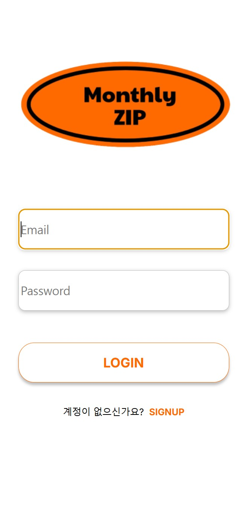
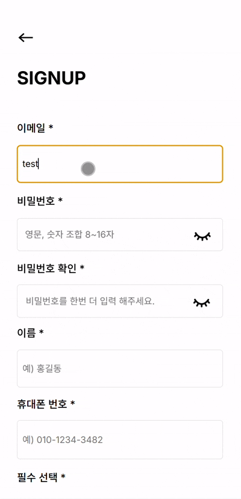
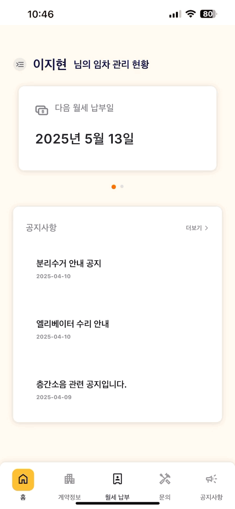
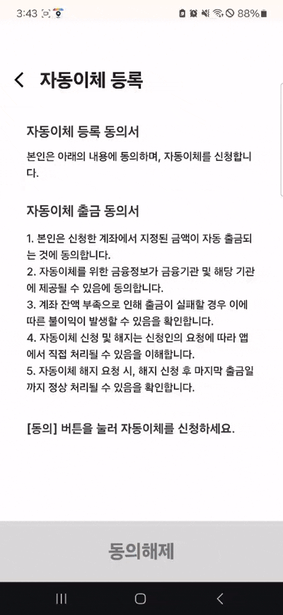
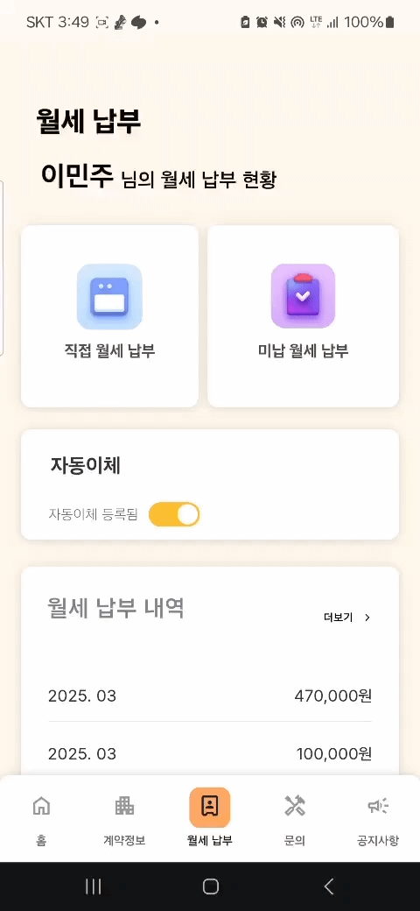
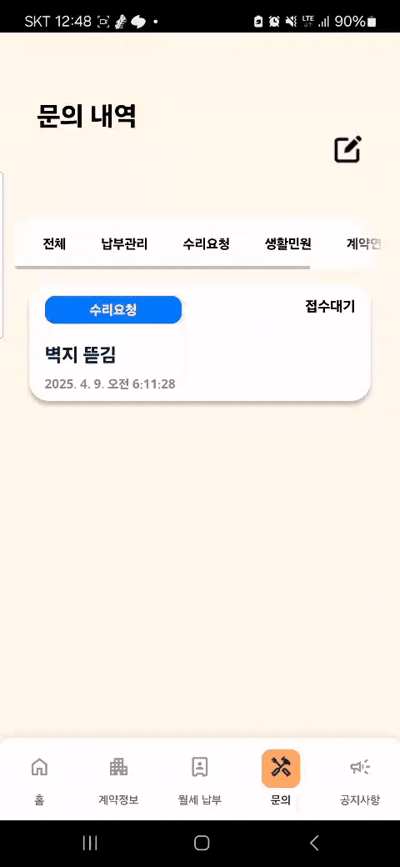

# 🏠 월간ZIP

### Samsung Software Academy For Youth 12th - 특화 프로젝트
#### 임대인과 임차인을 위한 월세 및 보증금 관리 웹사이트

> 2025.03.03 ~ 2025.04.11

 

---

1. **[웹 서비스 소개](#1-웹-서비스-소개)**
2. **[기술 스택](#2-기술-스택)**
3. **[주요 기능](#3-주요-기능)**
4. **[시스템 아키텍쳐](#4-시스템-아키텍쳐)**
5. **[서비스 화면](#5-서비스-화면)**
6. **[개발 팀 소개](#6-개발-팀-소개)**
   
## 1. 웹 서비스 소개

### ✨ 월간ZIP: 임대차인을 위한 스마트한 월세 관리 솔루션

월세 관리와 보증금 계산이 복잡하고 스트레스를 주는 경험을 해보셨나요?

임대차 계약과 월세 입금 내역을 수기로 관리하느라 시간을 낭비하고 계신가요?

월간ZIP과 함께 임대 관리의 모든 번거로움을 한 번에 해결해보세요!

#### 🌟 월간ZIP만의 특별함

    - 자동화된 월세 관리: 수동 관리의 번거로움 없이 자동으로 월세 청구 및 입금 확인
    - 스마트 알림 시스템: 월세 납부일 알림과 연체 방지를 위한 맞춤형 알림 서비스
    - 직관적인 대시보드: 임대인과 세입자 모두를 위한 투명하고 사용하기 쉬운 인터페이스

#### 💡 이런 분들에게 완벽해요

    - 여러 채의 부동산을 효율적으로 관리하고 싶은 임대인
    - 월세 납부 기록을 체계적으로 관리하고 싶은 세입자
    - 임대 관계에서 발생할 수 있는 분쟁을 미리 방지하고 싶은 모든 분

 

## 2. 기술 스택
 
### **Backend**

            

### **Frontend**

     

### **CI/CD**

   
  

### **Communication**

     

 

## 3. 주요 기능

|                기능                | 내용                                                                                                                                                                                                      |
| :--------------------------------: | :-------------------------------------------------------------------------------------------------------------------------------------------------------------------------------------------------------- |
|      **월세 자동 청구 및 관리**      | 설정된 날짜에 월세 입금 내역이 자동으로 반영됩니다. 세입자는 자신의 월세 납부 내역을 조회할 수 있으며, 집주인은 모든 세입자별로 월세 수금 상태를 임대인 대시보드에서 모니터링할 수 있습니다.                               |
|    **월세 연체 방지 및 미납액 관리**   | 월세 납부 일정을 미리 알려주는 문자 알림 서비스와 연체 시 경고 알림을 자동 발송합니다.                         |
|        **세입자 편의 기능**         | 집 유지보수 요청 기능을 통해 집주인에게 수리 요청(누수/누전 문제 등)을 보내고 처리 진행 상태를 조회할 수 있습니다.     
|        **월세 자동이체 기능**         | 임차인이 계좌 정보를 등록하고 기간 및 납부일을 설정하면, 설정한 날짜에 월세가 자동으로 이체됩니다.

 

 

## 4. 시스템 아키텍쳐

 

 

## 5. 서비스 화면

### 로그인 & 회원가입
|  |  |
|:---:|:---:|
| 로그인 화면 | 회원가입 화면 |

- JWT 기반 인증 시스템 구현
- 임대인/임차인 구분하여 회원가입 지원

--- 

### 임대인 서비스

### 1. 임대인 대시보드
|  |
|:---:|
| 임대인 대시보드 |

- 월별 수입 통계 및 연체 현황 분석
- 최근 문의 내역 실시간 확인

### 2. 세대 관리
|  |  |
|:---:|:---:|
| 세대 관리 | 계약코드 발행 |

- 도로명 주소 기준 건물 등록 및 관리
- 세대별 입주/공실 현황 실시간 확인
- 카카오 맵 API 활용해해 등록한 건물의 위치 조회
- 10분간간 유효 계약코드 발행 시스템

### 3. 임차인 관리
|  |  |  |
|:---:|:---:|:---:|
| 임차인 관리 | 문의 관리 | 공지사항 전달 |

- 세입자별 계약 정보 및 월세 납부 이력 관리
- 유지보수 요청 실시간 확인 및 처리
- 건물별 공지사항 전달 시스템

---

### 임차인 서비스

### 1. 임차인 대시보드
|  |
|:---:|
| 임차인 대시보드 |

- 월세 납부 현황 및 공지사항 실시간 확인

### 2. 월세 관리 화면
|  |
|:---:|
| 월세 관리 화면 |

- 월세 납부 내역 조회
- 보증금 현황 확인

### 3. 월세 납부 화면
|  |  |
|:---:|:---:|
| 자동이체 설정 | 월세 직접 결제 |

- 계좌등록과 날짜설정으로 자동이체 등록
- 자동이체 등록 여부 확인

### 4. 문의 등록
|  |
|:---:|
| 문의 등록 |

- 임차인이 임대인에게 궁금한 점이나 요청사항을 작성하여 전달

### 5. 공지사항 조회
|  |
|:---:|
| 공지사항 조회 |

- 임대인이 해당 건물에 작성한 공지사항 조회

 

## 6. 개발 팀 소개

---

|  |  |  |  |  | 
|---------------------------------------------------------------------------------------------------------------|----------------------------------------------------------------------------------------------------|---------------------------------------------------------------------------------------------------------------|-------------------------------------------------------------------------------------------------|--------------------------------------------------------------------------------------------------|--------------------------------------------------------------------------------------------------|
| 곽희섭 ([@HuiSeopKwak](https://github.com/HuiSeopKwak)) | 김유진 ([@zladb](https://github.com/zladb)) | 김성민 ([@ssm-kim](https://github.com/ssm-kim)) | 김민주 ([@hong00z](https://github.com/hong00z)) | 이지현 ([@ww42777](https://github.com/ww42777)) | 최연지 ([@yeonji3038](https://github.com/yeonji3038)) | 
| Leader / Back End | Back End | Infra / Back End | Front End | Front End | Front End |

 

## 📝 산출물

---

### 1. [기능 명세서](https://gravel-seagull-322.notion.site/1afef7bc762580fbaa03df1df705095b?pvs=4)

### 2. [와이어 프레임](https://www.figma.com/design/Zf5XDzkeLFFUZUo6hddF9C/%EC%9B%94%EA%B0%84-ZIP?node-id=0-1&p=f&t=TrUvVEuFhH5ZNduj-0)

### 3. [API 명세서](https://gravel-seagull-322.notion.site/API-1b4ef7bc76258019a0a4f6f80af26682?pvs=4)

### 4. [ERD](/docs/erd.png)

### 5. [포팅매뉴얼](/exec/포팅메뉴얼/)

### 6. [최종발표](/exec/월간ZIP_발표.pdf)
